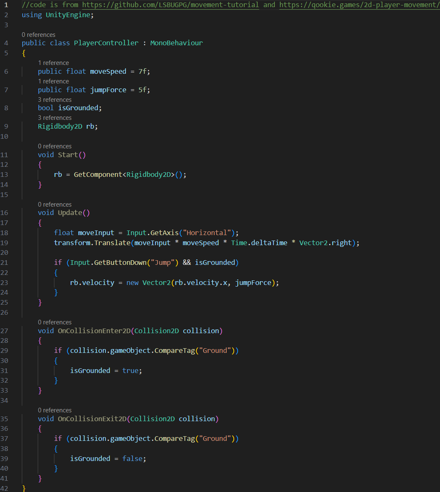

# Tutorial_4
 
Today we are going to learn how to make 2D player movement with side movement and jumping.

THe Unity version I am using for this will be 2022.3.46f1.

The first thing we are going to do is to create the placeholder for our character, I am going to use a triangle for this. You can find it by right clicking the hierachy then 2D objects > Sprites > Triangle. Once that is done we then need to add our 2 components to it. In the inspector we now need to click the add component button and add a "Rigidbody 2D" component as well as a "Collider 2D" of your choice, I will use "Polygon Collider 2D" for my one. You should use the collider most suitable for your application. Once that is done you then need to make something for your floor. You can use a square, found in right click hierachy > 2D objects > Sprites > Square, to create your platform by simply stretching it out and then duplicating it with the keybind Left control + D. After that you can leave a gap in the middle so you can jump across. Both of your squares will need a Box Collider 2D in order to collide with the triangle. Don't forget to set the tag for the 2 squares as well, you can do that by going to "Tag" in the inspector then open the drop down > add new tag > the + icon to add a new tag > Then type Ground as the tag name then click save. You wiil then be able to assign the tag as Ground.

Here is our code for this tutorial.

This code sets up our variables for our speed as well as our jump force, it then does the same for our grounded check and Rigidbody2D. our move speed and jump force are public variables so that they can be changed within unity while our bool and rigidbody are private, if there is nothing in fron then it will defualt to being private.

We then set up our rigidbody on launch and then we move onto the Update() method which waits for input from either the left and right arrow keys or the A and D keys. Instead of applying force to move the player we instead change the position which means that the player cannot stick to walls unlike in qookie.games's script. We then check if the Jump button, the spacebar, is being pressed and then only if the player is on the ground can they then jump.

 After that we check if there the player has collided with something, if it has the tag "Ground" then isGrounded is set to true. We then check the same thing but when the player stops colliding with something that has the "Ground" tag, setting isGrounded to false.

After that is done you simply need to drag the script from your assets onto the Triangle. To stop it from rotating around you can go into the RigidBody 2D and then under Contstraints there is an option to freeze the z rotation. You should now be able to jump and move around the 2D space you have made. The speed and jump force can be changed by looking at the inspector for the triangle and will save any values you put into it.

With that, I hope you have a great rest of your day and thank you for using this tutorial. 
